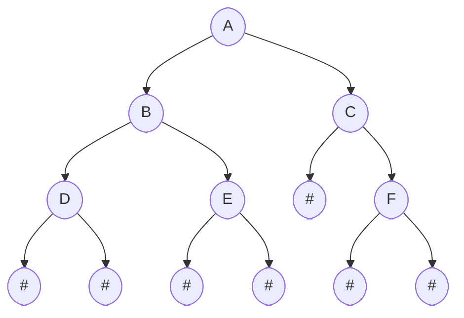

```mermaid
flowchart TD
a1([A])-->a2([B]) & a3([C])
a4([D])
a5([E])
a2-->a4 & a5
a6([#])
a7([F])
a3-->a6 & a7
a8([#])
a9([#])
a10([#])
a11([#])
a4-->a8 & a9
a5-->a10 & a11
a7-->a12([#]) & a13([#])
%%end
```