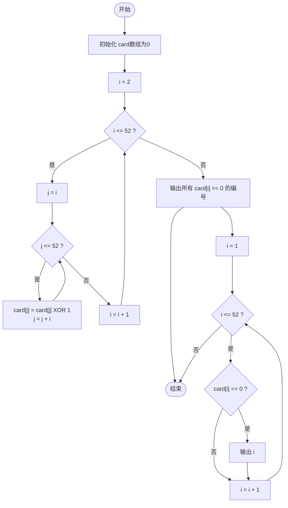

```mermaid
flowchart TD
    A([开始]) --> B[初始化 card数组为0]
    B --> C[i = 2]

    C --> D{ i <= 52 ? }

    D -- 否 --> H["输出所有 card[i] == 0 的编号"]
    H --> I([结束])

    D -- 是 --> E[j = i]

    E --> F{ j <= 52 ? }

    F -- 是 --> G["card[j] = card[j] XOR 1<br/>j = j + i"]
    G --> F

    F -- 否 --> J[i = i + 1]
    J --> D

    H --> K[i = 1]

    K --> L{ i <= 52 ? }

    L -- 是 --> M{" card[i] == 0 ? "}
    M -- 是 --> N[输出 i]
    M -- 否 --> O[i = i + 1]
    N --> O
    O --> L

    L -- 否 --> I
```