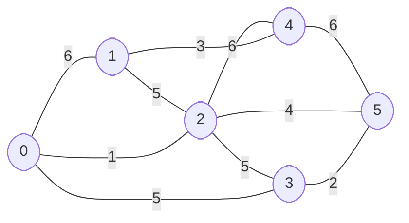

```mermaid
flowchart LR
    a0(["0"]) -- 6 --- a1(["1"])
    a2(["2"]) -- 6 --- a4(["4"])
    a2 -- 5 --- a3(["3"])
    a1 -- 5 --- a2
    a4 -- 6 --- a5(["5"])
    a2 -- 4 --- a5
    a0 -- 5 --- a3
    a3 -- 2 --- a5
    a0 -- 1 --- a2
    a1 -- 3 --- a4
```